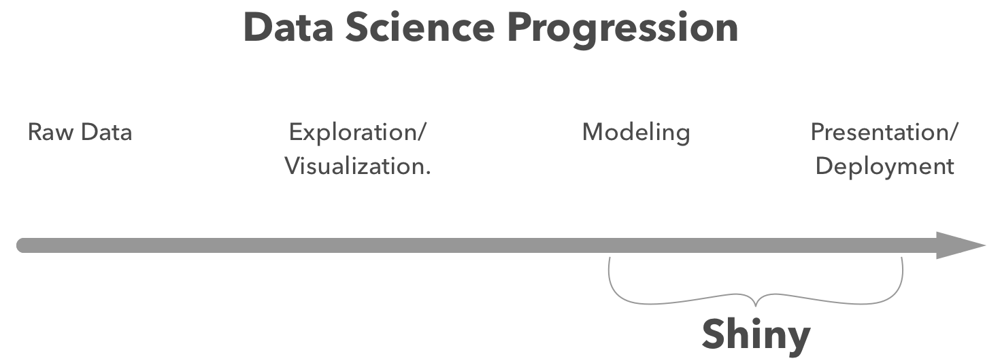

---

## Outline

- __Who__ am I?
- __What...__ 
    - is shinysense?
    - senses does it have?
- __How...__
    - is it made?
    - do I use it?
- __Why?__
    - Shiny's Role in Data Science.
    - Papr.
- __Where...__ 
    - is it being used?
    - do I see it going?


---

## Who am I?

- PhD Student at Vanderbilt University in Nashville, TN.
- Working with Jeff Leek and the Johns Hopkins Data Science Lab. 
- Formerly a
    - Software engineer ([Dealer.com](http://www.dealer.com/))
    - Data scientist ([Dealer.com](http://www.dealer.com/))
    - Data visualization person ([Conduce](https://www.conduce.com/), [University of Michigan](https://www.si.umich.edu/))
    - Journalist ([The New York Times](https://www.nytimes.com/))


# What?

---

## What is `shinysense`


- A package filled with shiny modules that use javascript to gather data from various sensors.
- Mobile first (aka I haven't figured out how to make some of the functions work well on desktop.)


---

## What senses are present?

---


## Touch

`shinyswipr`

- Embeds a card that can be swiped in different directions, the swipe direction is returned to shiny.
- Used in our app [`papr`.](https://jhubiostatistics.shinyapps.io/papr/)
- [Demo.](https://nickstrayer.shinyapps.io/shinysense_swipr_demo/) [Code for demo.](https://github.com/nstrayer/shinysense/blob/master/demo/swipr_demo.R)


## Touch

`shinydrawr`

- A simple line chart that allows the user to draw their guess at a trend after which the rest of the chart is revealed.
- Blatantly stolen from the New York Times article [You Draw It: What Got Better or
Worse During Obama’s Presidency](https://www.nytimes.com/interactive/2017/01/15/us/politics/you-draw-obama-legacy.html).
- [Demo.](https://nstrayer.shinyapps.io/drawr_demo/) [Code.](https://github.com/nstrayer/shinysense/blob/master/demo/drawr_demo.R)
  

  

## Hearing

`shinyear`

- Records audio on a button press and returns the fast-fourier transformed signal to the server.
- [Demo.](https://nickstrayer.shinyapps.io/shinysense_earr_demo/)  [Code.](https://github.com/nstrayer/shinysense/blob/master/demo/earr_demo.R)
   


## Motion

`shinymovr`

- Capture and return accelerometer data from your phone or tablet.
- [Demo.](https://nstrayer.shinyapps.io/shinymovr/)  [Code.](https://github.com/nstrayer/shinysense/blob/master/demo/movr_demo.R)
    


## Sight

`shinysee`

- Record images from a a webcam or mobile camera (android only unfortunately).
- Coming soon...
        


## Helpers

`shinypopup`

- A lot of times when you're developing an app using the above senses you need to let your user's know you're collecting their data. This module creates a popup that obscures a given section of your app that forces the user to accept your terms before they can go any further.
- Used in [`papr`](https://jhubiostatistics.shinyapps.io/papr/) to force people to accept our data use agreement.
- [Demo.](https://nickstrayer.shinyapps.io/shinypopup/)  [Code.](https://github.com/nstrayer/shinysense/blob/master/demo/popup_demo.R)


# Why?

## Shiny's Role in Data Science

Shiny is a great tool for presenting models/ analysis. But what about gathering the data?


<div class = "pic_by_text">
<div class = "pic_side">
 
</div>
<div class = "text_side">
Where Shiny sits now.
</div>
</div>


<div class = "pic_by_text">
<div class = "pic_side">
 
</div>
<div class = "text_side"> 
Overly ambitious goal.
</div>
</div>

---

## Mobile

A lot of shiny apps don't work well on mobile as they have been (understandably) built around a mouse and keyboard. 

`shinysense` tries to make it easier to build mobile friendly apps. 

This allows the use of shiny apps in environments where the user can't sit down at a computer. 

---

## Papr 

We were building a rather complex app and it was getting out of control, so we modularized. 

 

This saved us lines of code and allowed the UI to be more declarative. 

# How?

---

## How is it made?

- The R side
    - Shiny Modules
- Javascript side
    - Custom javascript libraries.
    
---

## Shiny Modules

A formalized way bundling chunks of code in shiny apps for reuse. Aka functions but with some nice added features. 

```{r, eval = F}
sayMessageUI <- function(id) {
  ns <- NS(id) #namespace function for keeping message unique
  p( textOutput(ns("sayMessage")) )
}
sayMessage <- function(input, output, session, message = "hi") {
  output$sayMessage <- renderText({ message })
}
ui <- fluidPage(
   titlePanel("useR Brussles Example"),
   sayMessageUI("message1"),
   sayMessageUI("message2")
)
server <- function(input, output) {
  message_1 <- callModule(sayMessage, "message1", "I'm just here for the")
  message_2 <- callModule(sayMessage, "message2", "beer and chocolate.")
}
```


---

## Javascript Binding

- Javascript has a ton of APIs for gathering data for input. 
- `shinysense` taps into these and makes them available to R. 

```js
class shinymovr{
  constructor(params){
    this.isOn = false;       //are we currently recording data?
    this.movement_data = []; //holds the most recent recordings data.
    this.send_dest = params.destination + "movement";
    this.watcher = this.make_watcher(params);
    document.getElementById(params.id).addEventListener("click", this.toggleButton.bind(this), true);
  }
  make_watcher(params){
    params.dom_target     = params.id;
    params.onMoveFunction = this.gather.bind(this);    //function that accumulates data while recording.
    return acceljs.accel(params);
  }
  ...};
  //watch for message from server saying it's ready.
  Shiny.addCustomMessageHandler("initialize_movr",
      params =>  new shinymovr(params)
  );
  ...
```
<a class = "info_link" href = "https://github.com/nstrayer/shinysense/blob/master/inst/js/movr.js">link to code</a>


## How do I use it?

Installation

-  Not on Cran so you have to install it from github. 
- `devtools::install_github("nstrayer/shinysense")`


Using in your app

- Uses the standard module formulation. 
- __UI__: `shinydrawrUI("outbreak_stats")`
- __Server__: `callModule(shinydrawr, "outbreak_stats", my_data, draw_start = 15)`

---

## Demo

<iframe src="https://nstrayer.shinyapps.io/drawr_demo/"></iframe>
  

# Where


## Is it being used?

A few people have already bravely started using shinysense. 

- [Papr](https://jhubiostatistics.shinyapps.io/papr/)
    - __Description:__ Tinder-esque way of taking the last pure thing in our society and corrupting it. 
    - __Uses:__ `shinyswipr`, `shinypopup`. 
- [Louisville Crime Rates](https://rkahne.shinyapps.io/louisville_crime_rates/)
    - __Description:__ Guess temporal trends in crime rates in the city of Louisville. 
    - __Uses:__ `shinydrawr`. 
- [GenomeBot Tweet Generator](http://www.jedidiahcarlson.com/shiny/genomebot_interface/)
    - __Description:__ Rate the output of a model by swiping directly on it. 
    - __Uses:__ `shinyswipr`.
- [contributr](https://ropensci.shinyapps.io/contributr/)
    - __Description:__ rOpenSci project to help connect useRs with github issues. 
    - __Uses:__ `shinyswipr`.
  
## Where is shinysense now?

Currently it could be classified as whatever comes before alpha in the development cycle. 

There are lots of bugs and testing for the R code is not implemented at all. (Still building a swiping robot).

Still it has been used in some well trafficked apps and doesn't seem to have caused any serious harm.  

## Where do I see it going?

Becoming an easy to use, thoughtless process for gathering data. 

Easing the process of deploying statistical models in real-world environments such as emergency rooms, etc. 

CRAN... eventually. 

## Thanks!

Some potentially valuable info: 

- Shinysense repo: https://github.com/nstrayer/shinysense
- My email: nick.strayer@gmail.com